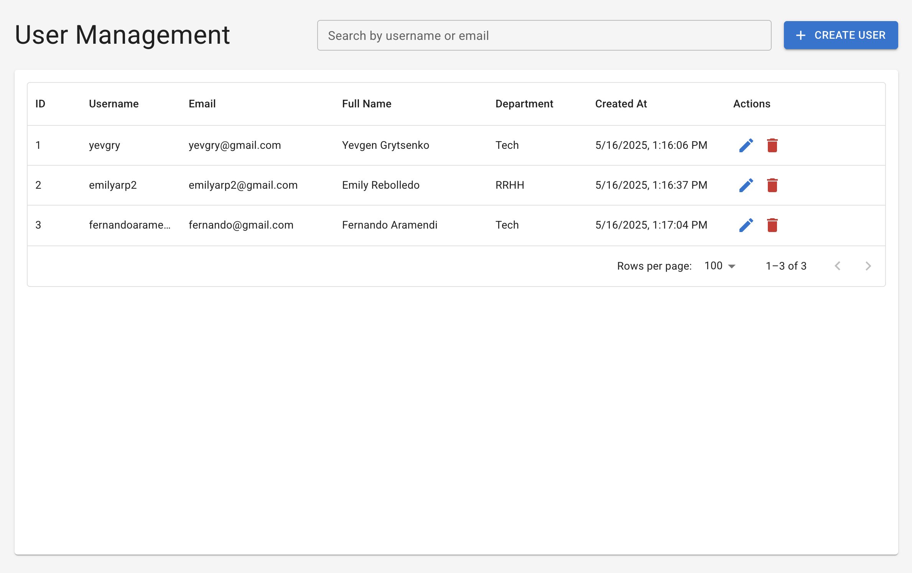

# User Management Portal

## Description

The **User Management Portal** is a full-stack application for managing users within an organization. It allows administrators to create, read, update, and delete users, as well as view and group users by department. It features robust validations, error handling, and a modern, responsive interface.

## Screenshots

> **Main dashboard with user table**
>
> 

> **Edit user modal**
>
> 

> **Delete confirmation dialog**
>
> 

> **Create user modal with validation**
>
> 

## Technologies Used

- **Backend:** FastAPI, SQLAlchemy, SQLite, Pydantic, Passlib
- **Frontend:** React, Material-UI (MUI), Axios
- **Others:** Docker (optional), Python-dotenv

## Architecture

- **Backend:**
  - RESTful API built with FastAPI
  - SQLite database
  - Models and validations with SQLAlchemy and Pydantic
  - Password encryption with Passlib
  - Logging and error handling
  - Automatic documentation with Swagger (OpenAPI)

- **Frontend:**
  - React application with Material-UI
  - Dynamic table to display users (DataGrid)
  - Modal forms for creating and editing users
  - Real-time validations
  - Confirmation dialog for deleting users

## Main Features

- **User CRUD:** Create, read, update, and delete users
- **Validations:**
  - Unique and valid email
  - Unique username, 6-20 characters, alphanumeric only
  - Minimum password length of 8 characters
  - Valid department (Tech, RRHH, Sales)
- **Table grouped by department**
- **Sorting and filtering**
- **Delete confirmation**
- **Clear error handling and messages**

## Installation and Usage

### 1. Clone the repository
```bash
git clone <REPOSITORY_URL>
cd user-management-portal
```

### 2. Backend (FastAPI)
```bash
cd backend
python3 -m venv venv
source venv/bin/activate
pip install -r requirements.txt
uvicorn main:app --reload
```
- Access the API documentation at: [http://localhost:8000/api/docs](http://localhost:8000/api/docs)

> **Running Backend**
>
> 

### 3. Frontend (React)
```bash
cd ../frontend
npm install
npm start
```
- Access the application at: [http://localhost:3000](http://localhost:3000)

> **Running Frondend**
>
> 

## API Testing with Swagger (OpenAPI)

You can easily test and explore the API endpoints using the built-in Swagger UI provided by FastAPI.

### How to Access Swagger UI

1. **Start the backend server** (if not already running):
   ```bash
   uvicorn backend.main:app --reload
   ```
2. **Open your browser and go to:**
   
   [http://localhost:8000/api/docs](http://localhost:8000/api/docs)

### What You Can Do
- View all available API endpoints, their methods, and required/requested data.
- Try out requests directly from the browser (GET, POST, PUT, DELETE, etc.).
- See example requests and responses for each endpoint.
- Validate your payloads and see error messages in real time.

This is a great way to quickly test the API without needing any external tools like Postman or curl.

> 

## License
This project is for educational and demonstration purposes only.
